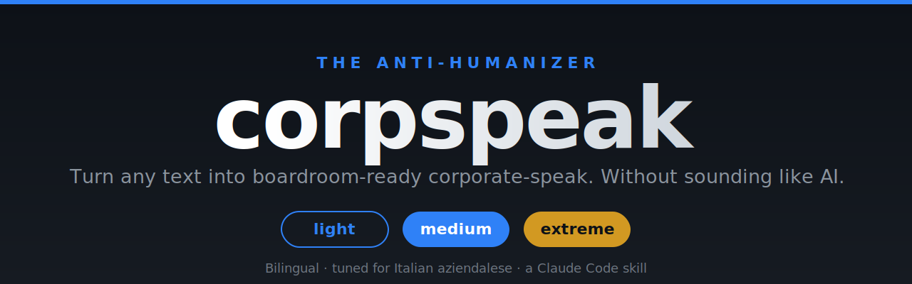

<a name="top"></a>

<div align="center">



### Turn any text into boardroom-ready corporate-speak. Three dials, two languages, and it won't smell like AI.

[](https://github.com/giorgiozamboni/corpspeak/stargazers)
[](https://github.com/giorgiozamboni/corpspeak/network/members)
&nbsp;
[](LICENSE)
[](https://github.com/giorgiozamboni/corpspeak/commits)
[](https://claude.com/claude-code)
[](#-bilingual-and-tuned-for-italian)

**[View Demo](#-see-it-in-action)** · **[Report Bug](https://github.com/giorgiozamboni/corpspeak/issues)** · **[Request Feature](https://github.com/giorgiozamboni/corpspeak/issues)** · **[PlayMind Studio](https://playmindstudio.it/)**

[](https://twitter.com/intent/tweet?text=corpspeak%3A%20the%20anti-humanizer%20that%20turns%20any%20text%20into%20boardroom-ready%20corporate-speak%20without%20sounding%20like%20AI&url=https://github.com/giorgiozamboni/corpspeak&hashtags=ClaudeCode,AI)

</div>

---

## 📑 Table of contents

- [What is corpspeak](#-what-is-corpspeak)
- [See it in action](#-see-it-in-action)
- [The three dials](#-the-three-dials)
- [Why it's different: the anti-AI filter](#-why-its-different-the-anti-ai-filter)
- [Bilingual, and tuned for Italian](#-bilingual-and-tuned-for-italian)
- [Install](#-install)
- [Usage](#-usage)
- [Roadmap](#-roadmap)
- [Contributing](#-contributing)
- [Author](#-author)
- [Acknowledgments](#-acknowledgments)
- [License](#-license)

---

## 🤔 What is corpspeak

**corpspeak is the opposite of a humanizer.** Where a humanizer strips the jargon out of text to make it sound natural, corpspeak puts it *in*, on purpose. "Fixing problems" becomes "troubleshooting the pain points." "Talking to colleagues" becomes "aligning with stakeholders." "Using" becomes "leveraging."

The twist that makes it actually usable: it has a built-in **anti-AI filter**. Most attempts at "make this sound corporate" end up sounding like ChatGPT cosplaying an executive (em dashes everywhere, fake triads, "stands as a testament to"). corpspeak keeps the jargon you asked for but strips the structural tells, so the result reads like a *real* manager wrote it, not a bot imitating one.

> Built with the Claude Code [skill-creator](https://claude.com/claude-code) and benchmarked: in head-to-head tests it beat plain Claude 95% to 70% on producing genuine corporate register that does not read as AI.

<p align="right">(<a href="#top">back to top</a>)</p>

## ✨ See it in action

**Input** (a flabby work message):
> we tried the new tool but it didn't really help the team work faster, so we should probably stop using it

| Dial | Output |
|------|--------|
| 🪶 **Light** | We piloted the new tool, but it did not improve the team's speed, so we recommend discontinuing it. |
| 💼 **Medium** | Following the pilot, the new tool did not move the needle on team throughput. The recommendation is to discontinue adoption and reallocate the bandwidth to higher-impact solutions. |
| 🔥 **Extreme** | Post-pilot, the tool failed to move the needle on team velocity. Recommendation: sunset adoption and reallocate bandwidth toward higher-leverage, ROI-positive enablers. |

<details>
<summary>🇮🇹 Italian example (click to expand)</summary>

**Input:**
> ciao ragazzi, le vendite sono andate male questo trimestre, dobbiamo capire perché e trovare una soluzione prima di lunedì

**Medium:**
> Team, abbiamo chiuso il trimestre sotto target sul revenue. Serve un allineamento per fare troubleshooting sulle criticità e definire gli action item entro lunedì.

**Extreme:**
> Q chiuso sotto target sul revenue. Serve un allineamento cross-funzionale per fare troubleshooting data-driven sulle criticità e mettere a terra gli action item entro lunedì, con ownership chiara su ogni workstream.

</details>

<p align="right">(<a href="#top">back to top</a>)</p>

## 🎚️ The three dials

| Level | Vibe | When to use |
|-------|------|-------------|
| 🪶 **Light** | "A serious professional" | Real work documents you actually have to send. Polish, not parody. |
| 💼 **Medium** *(default)* | "A competent manager" | Most cases. Jargon present but dosed and credible. |
| 🔥 **Extreme** | "A consultant who oversells" | Irony, motivational slides, buzzword bingo. Deliberately over the top (it's called *extreme* for a reason). |

You set the dial in plain language: `make this corporate, light touch` or `livello estremo`.

<p align="right">(<a href="#top">back to top</a>)</p>

## 🧱 Why it's different: the anti-AI filter

corpspeak borrows the detection rules from the *humanizer* skill, then inverts the goal. The business vocabulary you asked for (leverage, stakeholder, KPI, deliverable) stays. The *structural* AI tells get removed every time:

- ❌ Em dashes and en dashes (the single most reliable AI tell)
- ❌ Decorative emojis, curly quotes
- ❌ Forced rule of three ("innovation, efficiency and growth")
- ❌ Fake "-ing" depth ("optimizing processes, enabling synergies, ensuring value")
- ❌ Significance inflation ("stands as a testament to")
- ❌ Generic motivational closers ("the future is bright")

The principle in one line: **real corporate is dense but operational** (actions, owners, deadlines, numbers). **AI-corporate is dense but empty.** corpspeak always aims for the first.

> Fun fact: this README is em-dash-free on purpose. The skill practices what it preaches.

<p align="right">(<a href="#top">back to top</a>)</p>

## 🌍 Bilingual, and tuned for Italian

Most "corporate speak" tools only handle English. corpspeak is genuinely bilingual, and it is specifically tuned for Italian *aziendalese*, including the real-world **itanglese** that Italian offices actually speak: *"ti giro la mail"*, *"ci allineiamo in call"*, *"lo schedulo"*, *"quick win"*, *"mettere a terra"*. It does not force a pure-Italian translation of terms that stay in English at work.

By default it answers in the language of your input. Ask for the other language, or both, and it complies.

<p align="right">(<a href="#top">back to top</a>)</p>

## 🚀 Install

**Option A — drop-in folder (Claude Code):**
```bash
git clone https://github.com/giorgiozamboni/corpspeak.git
cp -r corpspeak ~/.claude/skills/corpspeak
```

**Option B — packaged skill:**
Download `corpspeak.skill` from [Releases](https://github.com/giorgiozamboni/corpspeak/releases) and install it via the `/plugin` interface in Claude Code.

No API keys, no dependencies.

<p align="right">(<a href="#top">back to top</a>)</p>

## 💬 Usage

```text
/corpspeak make this sound corporate, medium level:
"we lost two clients this quarter and we're a bit worried about cash"
```

Or just ask in natural language, with or without the slash command:

- "rendi più aziendale questa mail, livello leggero: ..."
- "buzzword it up for the board deck: ..."
- "make this LinkedIn post sound more executive: ..."
- "trasforma in linguaggio da consulente, in inglese: ..."

If you do not specify a level, it uses **medium**. If you do not specify a language, it matches your input.

<p align="right">(<a href="#top">back to top</a>)</p>

## 🗺️ Roadmap

- [ ] Sector flavors (finance-only, tech/startup-only, strategy-consulting-only)
- [ ] A fourth "satire" dial for pure comedy
- [ ] More languages (ES, FR, DE)
- [ ] An `--explain` mode that annotates every swap it makes
- [ ] Community lexicon packs for local office dialects

Have an idea? [Open an issue](https://github.com/giorgiozamboni/corpspeak/issues).

<p align="right">(<a href="#top">back to top</a>)</p>

## 🤝 Contributing

Contributions make the open-source world go round. Ideas welcome: new bridge phrases, sector flavors, a fourth level, or lexicon entries for your local office dialect. See [CONTRIBUTING.md](CONTRIBUTING.md), open an issue, or send a PR.

And if corpspeak made you smile (or saved your next deck), a ⭐ on the repo goes a long way.

<p align="right">(<a href="#top">back to top</a>)</p>

## 👤 Author

Built by **Giorgio Zamboni** at **[PlayMind Studio](https://playmindstudio.it/)**, where we bring AI into real workflows, real decisions, and the work that actually matters.

- 🌐 Website: [playmindstudio.it](https://playmindstudio.it/)
- 💼 LinkedIn: [giorgio-zamboni-engineer](https://www.linkedin.com/in/giorgio-zamboni-engineer/)
- 🐙 GitHub: [@giorgiozamboni](https://github.com/giorgiozamboni)

<p align="right">(<a href="#top">back to top</a>)</p>

## 🙏 Acknowledgments

- The *humanizer* skill, whose AI-detection rules corpspeak inverts
- [Anthropic Claude Code](https://claude.com/claude-code) and its skill-creator
- [Wikipedia: Signs of AI writing](https://en.wikipedia.org/wiki/Wikipedia:Signs_of_AI_writing), the source of the anti-AI patterns

## 📄 License

MIT. Use it, fork it, ship it. See [LICENSE](LICENSE).

---

<div align="center">
<sub>Built by <a href="https://playmindstudio.it/">Giorgio Zamboni · PlayMind Studio</a> with the Claude Code skill-creator. The anti-humanizer your boardroom deserves.</sub>
</div>
